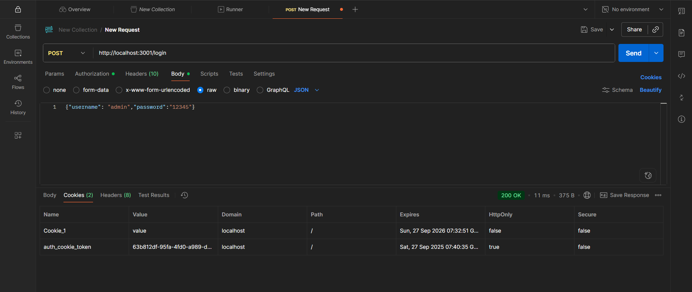

# SIMPLE AUTH

## 🧩 Description
Bài lab thực hành xác thực cơ bản trong NodeJS bằng **Basic Auth** và **Cookie Auth**.

---

## ⚙️ Run project
```bash
npm install
node basic_auth.js
# hoặc
node cookie_auth.js
# Để chạy ta cần tải đầy đủ các thư viện để chạy

# Thư viện dùng để kết nối với mongodb
npm install mongoose
# Thư viện dùng để lưu trữ cookie
npm install cookie-parser
```

---

## 🧪 Test with Postman

### 🔹 Test Basic Auth
**Endpoint:** `post http://localhost:3000/`

**Authorization type:** Basic Auth  
- Username: `admin`  
- Password: `123456`

📸 *Kết quả test:*  


---

### 🔹 Test Cookie Auth
**Endpoint:**  
1. `POST http://localhost:3000/login`  
2. Kiểm tra cookie trong Postman → Cookies  

📸 *Tạo nơi chứa cookie:*  


📸 *Kết quả test trong postman:*  


📸 *Kết quả test trong mongodb:*  


---


## 📘 Author
**22670361 - Võ Thị Cẩm Tú**
